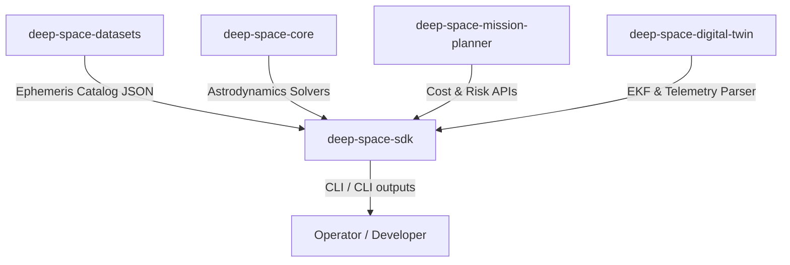

# Interface Control Document (ICD)
## Deep Space Mission OS

### Document Control
* **Document ID**: DSM-ICD-001
* **Version**: 1.0.0
* **Date**: 2026-06-12
* **Status**: APPROVED
* **Security**: Public / Open Source

---

## 1. Scope and Interfaces
This document defines the interface boundaries, schemas, and data structures between the components of the Deep Space Mission OS ecosystem. 



---

## 2. Data Structure Schemas

### 2.1 Planetary Catalog Schema (`de421_catalog.json`)
The planetary body database uses a flat JSON structure where keys represent celestial bodies and properties define Keplerian elements relative to the Sun:
```json
{
  "$schema": "http://json-schema.org/draft-07/schema#",
  "type": "object",
  "additionalProperties": {
    "type": "object",
    "properties": {
      "a": { "type": "number", "description": "Semi-major axis in km" },
      "e": { "type": "number", "description": "Eccentricity (dimensionless)" },
      "i": { "type": "number", "description": "Inclination in degrees" },
      "raan": { "type": "number", "description": "Right Ascension of the Ascending Node in degrees" },
      "arg_p": { "type": "number", "description": "Argument of periapsis in degrees" },
      "mu": { "type": "number", "description": "Gravitational parameter in km^3 / s^2" }
    },
    "required": ["a", "e", "i", "raan", "arg_p", "mu"]
  }
}
```

### 2.2 CCSDS Telemetry Ingestion Format
Telemetry ingestion parses binary frames adhering to the CCSDS packets layout:
* **APID**: 2 bytes (unsigned integer, big-endian)
* **Timestamp**: 4 bytes (unsigned integer, big-endian)
* **Data Value**: 8 bytes (double-precision float, big-endian)

| Offset (Bytes) | Field | Type | Description |
|---|---|---|---|
| 0 - 1 | APID | uint16 | Application Process Identifier |
| 2 - 5 | Timestamp | uint32 | Epoch offset timestamp in seconds |
| 6 - 13 | Data Value | float64 | Telemetry sensor reading |

---

## 3. Developer API Specifications (`deep-space-sdk`)

### 3.1 `DeepSpaceClient` Python API
Developers interact with the client programmatically:

* **`get_orbit_velocity(r: float, a: float, mu: float) -> float`**
  * Calculates current orbital speed (km/s).
* **`plan_mission(origin: str, destination: str, payload_mass_kg: float) -> dict`**
  * Generates mission feasibility, total delta-v required, and timeline event arrays.
* **`estimate_mission_cost(dry_mass: float, propellant_mass: float, launch_cost: float, ops_months: float) -> dict`**
  * Breakdown of mission expenses (Dry mass, propellant, operations, total USD).
* **`compute_mission_risk(duration_days: float, radiation_rads: float, components: int) -> float`**
  * Failure probability value between 0.0 and 1.0.
* **`log_twin_state(param_name: str, val: float) -> None`**
  * Logs telemetry sensor data values in the digital twin history.
* **`forecast_twin_state(param_name: str, steps_future: int) -> float`**
  * Extrapolates historical sensor states using a linear regression fit.
* **`predict_twin_anomaly(param_name: str, steps_future: int, safety_bounds: tuple) -> (bool, float)`**
  * Returns an anomaly flag and the predicted value if it violates safety boundaries.

---

## 4. Command Line Interface (CLI) Schemas

The SDK CLI exposes endpoints structured as follows:

```bash
# Mission Planning
python -m deep_space_sdk.cli plan --destination <BODY> --payload-mass <MASS> [--origin <BODY>] [--json]

# Cost Estimation
python -m deep_space_sdk.cli cost --dry-mass <KG> --propellant-mass <KG> --launch-cost <USD> --ops-months <MONTHS> [--json]

# Risk Assessment
python -m deep_space_sdk.cli risk --duration <DAYS> --radiation <RADS> --components <COUNT> [--json]

# Digital Twin Anomaly Detection
python -m deep_space_sdk.cli twin --state-name <VAR> --values <V1 V2 ... VN> --min-val <MIN> --max-val <MAX> [--forecast-steps <STEPS>] [--json]
```
